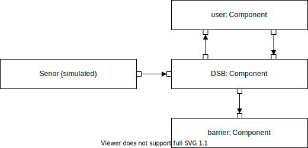

#Example 1: MVP

*SORRIR Example – Software only*

This example of a minimal viable prototype can be run locally on your computer.
It simulates a parking garage entrance scenario and consists of the following components:

* **Sensor**
   * Actually not a component, because you "simulate" manually the sensor make a REST call (see below). The 
     sensor can send events `DETECTION` and `NOTHING` to the DSB.
* **DSB** 
   * The display sensor box (DSB) represents the control unit of a barrier.
   * If it receives a `DETECTION` from the sensor (because a car is waiting in front of it), it sends out a `ASK_SELECTION` to the user.
   * After the user has answered with `SELECTION_MADE`, the DSB tells to barrier to `OPEN`.
   * After receiving a `NOTHING` from the barrier, it tells the barrier to `CLOSE`.
* **User**
   * Answers always with `SELECTION_MADE` when received a `ASK_SELECTION` from the DSB.
* **Barrier**
   * Consumes events `OPEN` and `CLOSE` received by the DSB.
    
## How to Start

Navigate to the root directory of this example "example-1-mvp". Open three terminal windows and run:

* `npm run startExecutor -- --to-execute a --env production` to start the Barrier
* `npm run startExecutor -- --to-execute b --env production` to start the DSB
* `npm run startExecutor -- --to-execute c --env production` to start the User 

Now, your parking garage is ready to go. You can see this from the logs, e.g., `Barrier`'s initial state is `IDLE`:

`{"level":"info","message":"","timestamp":"2021-07-30T13:12:55.300Z","metadata":{"context":{"stakeholder":"USER",
"contextFields":{"unit":"b","component":"DSB","degradationMode":"operational"}},"host":"computer.local","data":
{"componentState":"fsm,IDLE,my,","events":[]}}}`

## Simulate a Car

Open another terminal window to simulate a car in front of the barrier by making the following REST call:

* `curl -X POST -H "Content-Type: application/json"  -d '{"event": "DETECTION"}' http://localhost:1235/b/DSB/FROM_SENSOR`
  
The call sends an event of the type `DETECTION` to the DSB through port `FROM_SENSOR`. After the processing of that 
event by the DSB and the User, the Barrier remains open:

`{"level":"info","message":"","timestamp":"2021-07-30T13:15:11.048Z","metadata":{"context":{"stakeholder":"USER",
"contextFields":{"unit":"a","component":"barrier","degradationMode":"operational"}},"host":"computer.local","data":
{"componentState":"fsm,OPEN,my,","events":[]}}}`

To close the barrier, you can simulate that the car has passed by calling:

`curl -X POST -H "Content-Type: application/json"  -d '{"event": "NOTHING"}'  http://localhost:1235/b/DSB/FROM_SENSOR`